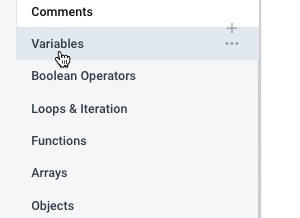

# Welcome to the Imba Guide

## Intro

If you are familiar with programming concepts, or you simply need to quickly review different elements of the Imba Language, this flash documentation will provide you a quick preview nearly anything in Imba 2.

For more detailed explanation scroll down to the Guide Section, to get a more indepth look at each concept.

## How To Use

👈 Browse through the pages on the left to find different subjects

👉 On the right, you can navigate through the headers of each page. 

🔎 Use the search on the top right if you need to quickly find something you lost.

## What is Imba

Imba is a programming language for building web applications, but it is on a class of its own with two main innovations:

* Its beautiful syntax and programming philosophy opens up new and efficient ways to build web applications. 
* It leverages on the power of JavaScript by compiling down to readable and hyper-efficient JavaScript. It opens up the door to a new magnitude of performance eclipsing the performance of JavaScript frameworks such as react and view 10-20 fold.

  > Note: Imba is not a framework. It does not define the application design process and paradigm for building web applications.

### How does Imba do this?

In Imba, DOM elements are first-class citizens. Your {declarative} {Views} are compiled to an inline DOM. That is what leads to the 20x performance increase above the virtual DOM implementations.

New Version of Intro:

### What is Imba

Imba is a language for building fast web applications. Thought it can use a State management system, it does not require one. Your Imba app will be compiled into JavaScript at build time, and will be plain vanilla JavaScript ready to run on the browser. This gives you a performance edge over languages and frameworks that need to be interpreted at run time.

You can build apps, front-end to backend with Imba as it is with scrimba.com, but you may also add it incrementally to your existing code base. You also use Imba to build standalone components and modules that work anywhere JavaScript does, and they will not require any bulky dependencies.

### What is this tutorial

You will need to have a basic understanding of HTML, CSS, and JavaScript, since those are the languages that Imba builds with behind the scenes. Familiarity with other web frameworks and other languages like JavaScript and ruby will surely be helpful in the programming concepts of Imba, but the aim of this tutorial is to help you build web apps with Imba and with no prior knowledge of any other programming language.

### Understanding Components

Imba facilitates a component based web app architecture, where you can create reusable self-contained blocks of code into separate Imba files.

