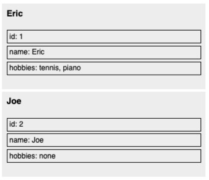

# Loops & Iteration

You can use loops in functions, classes, or tags, both for the controller or the view.

## For loop \(for in loop\)

The for loop can be used both in the front end or the back end.

```ruby
let languages = ['Imba', 'Svelte', 'Javascript']

for item in languages
	console.log item

tag app-root
	def render
		<self>
			<ul>
				for item in languages
					<li> item
```

> [See on Scrimba](https://scrimba.com/c/cv8Mvau8)

## Keys of Object

```ruby
# iterate through keys of object
for key,value of {a: 1, b: 2}
	console.log key + ": " + value * 2
	
# prints:
# a: 2
# b: 4
```

## While Loop

```ruby
while true
	break if Math.random < 0.1
```

> 🎮 [Play with the code on Scrimba](https://scrimba.com/c/ceMgLbUN)

## Until Loop

```ruby
let counter = 0
until Math.random() < 0.1
	counter++
```

> [🎮 Play with the code on Scrimba](https://scrimba.com/c/cZPNedCD)

## Loop with Index Argument

```ruby
# looping with index argument
for item, i in [1,2,3]
	console.log i + ": " + item * 1

# prints:
# 0: 1
# 1: 2
# 2: 3
```

## Loop Expressions

```ruby
# loops are expressions
var list = [1,2,3,4,5]
var doubles = for num in list
	num * 2
console.log doubles

# prints:
# [2,4,6,8,10]
```

## Loop with Intervals

```ruby
# go through every other element
for item in [1,2,3,4,5] by 2
	item * 2
	console.log item

# prints:
# 1
# 3
# 5
```

## Filter by Condition

```ruby
# filter by condition
let list = [1,2,3]
for num in list when num > 1
	console.log num
# prints:
# 2
# 3
```

> **Tip!** Any type of object can support being iterated with forin in Imba. If the compiler does not know that the target is an array \(at compile-time\) it will look for \(and call\) `target.toArray`if it exists, and then loop through this.

## Loop Over Own Keys \(for of\)

The following example will render the names of the keys along with the values of the properties of each object.

```ruby
let users = [
	id: 1
	name: "Eric"
	hobbies: [
		"tennis"
		" piano"
	]
	---
	id: 2
	name: "Joe"
	hobbies: [
		"none"
	]
]
tag app-root
	def render
		<self>
			for user in users
				<div> 
					<h3> user.name
					<ul> for own key, item of user
						<li> "{key}: {item}"
```

> [Play with the code on Scrimba](https://scrimba.com/c/cD7aJmuW)



## Loop Over All Keys \(for of\)

```ruby
# loop over all keys of object
var object = {a: 1, b: 2, c: 3, d: 4}
for k,value of object
	console.log "{k} 👉 " + value
	
# prints:
# a 👉 1
# b 👉 2
# c 👉 3
# d 👉 4

```

## Continue

Continue without Arguments

```ruby
var result = for num in [1,2,3,4,5]
	continue if num == 3
	num * 2
console.log result
# prints
# [2,4,8,10]
```

Continue with an Argument

```ruby
var result = for num in [1,2,3,4,5]
	continue -1 if num == 3
	num * 2
console.log result
# acts like early return within map

# prints:
# [2,4,-1,8,10]
```

## Break

Break without arguments

```ruby
var result = for num in [1,2,3,4,5]
	break if num is 3
	num
console.log result

# prints:
# [1,2]
```

Break with Argument

```ruby
var result = for num in [1,2,3,4,5]
	break 'done' if num is 3
	num
console.log result

# prints:
# [1,2, "done"]
```


